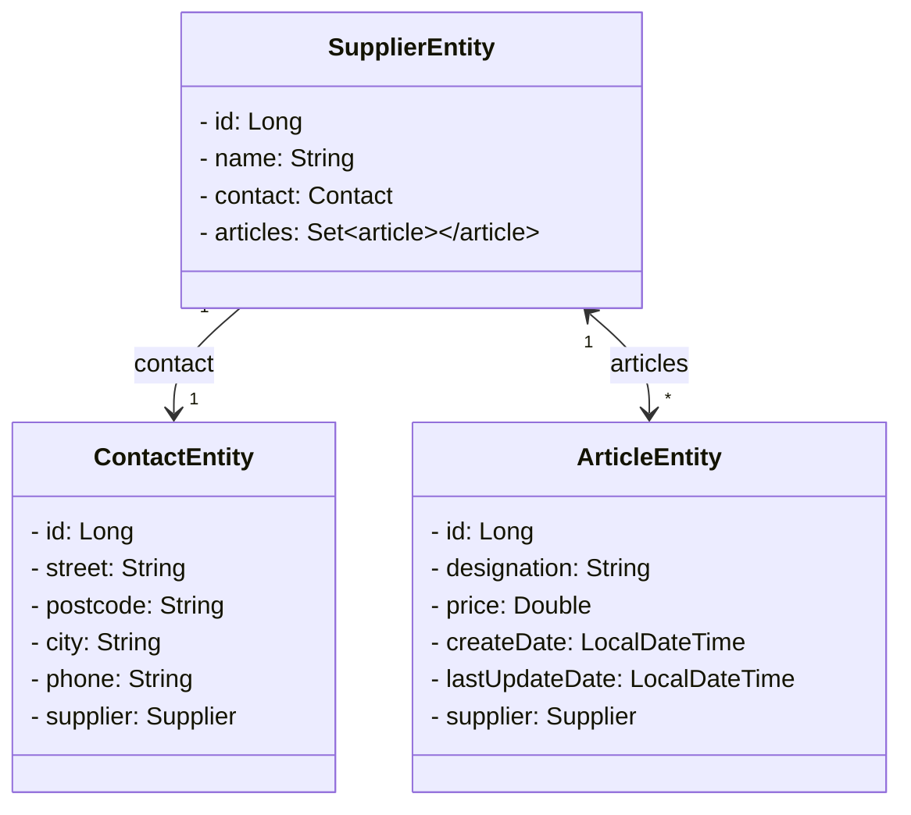

# Implementierung der Models
> **Fortschritt:** <!-- wird live gezählt -->
> - Gesamt: <span id="t-total">0</span>
> - Erledigt: <span id="t-done">0</span>

Für die Validierung unserer Modelklassen benötigen wir eine weitere Abhängigkeit. 
- [ ] Füge daher in der `build.gradle.kts` die folgende Abhängigkeit am Ende des Dependencies‑Bereichs hinzu:

```kotlin
implementation("org.springframework.boot:spring-boot-starter-validation")
```

Bisher haben wir eine Package‑Struktur gewählt, die die Dateien nach ihrer Schicht innerhalb der Anwendung sortiert hat: `controller`, `model`, `repository`. Das ist im Prinzip auch in Ordnung. Beim Entwickeln größerer Anwendungen kann es aber nerven, ständig zwischen den Packages hin und her wechseln zu müssen, sobald man Änderungen an einem Modul vornimmt, weil sich der Controller, das Model, womöglich verschiedene Services und das Repository in unterschiedlichen Packages befinden. Wir wählen daher dieses Mal eine **Sortierung nach Modulen**. 
- [ ] Erstelle daher erst einmal die Packages `supplier`, `article` und `contact`.

Um den Zweck der Modelklassen im Namen deutlicher hervorzuheben, hängen wir an jede Modelklassenbezeichnung das Wörtchen **Entity** an. Das erleichtert noch einmal die Suche nach unseren Klassen in der neuen Package‑Struktur.



## ContactEntity

- [ ] Implementiere im Package `contact` eine Klasse mit dem Bezeichner `ContactEntity`. Lasse Konstruktoren, Getter und Setter von Lombok generieren. Annotiere analog zur letzten Übung die Klasse, so dass sie von Spring Data in einem Datenbankmodell abgebildet wird. 
- [ ] Benutze für die automatische Generierung des Primärschlüssels dieses Mal die Strategie **IDENTITY**. Sie bewirkt, dass nicht mehr die angelegten Entitäten egal welchen Typs von 1 beginnend, sondern die Entitäten jeder einzelnen Tabelle beginnend mit 1 durchgezählt werden.

Um die Standardbezeichnungen von Hibernate zu umgehen und Kontaktobjekte später validieren zu können, erhält die Klasse `ContactEntity` weitere Annotationen. Zum einen soll es nicht möglich sein, Kontaktdaten mit null‑Werten anzulegen. Es sollen nur vollständige Adressen mit Angabe der Straße, der Postleitzahl und des Ortes akzeptiert werden, wobei die Länge der Straßen‑ und der Ortangabe 50 Zeichen nicht überschreiten darf. Zum anderen soll die Datenbanktabelle für den Kontakt nicht den Bezeichner der Klasse haben, sondern **„supplier_contact“** heißen. Außerdem soll die Spalte für die Postleitzahl mit der englischen Abkürzung **„zip“** bezeichnet werden. 
- [ ] Annotiere die Klasse daher wie unten abgebildet.

```java
@Entity
@Table(name = "supplier_contact")
@Getter
@Setter
@NoArgsConstructor
public class ContactEntity {

    @Id
    @GeneratedValue(strategy = GenerationType.IDENTITY)
    private Long id;

    @NotBlank(message = "Street is mandatory")
    @Size(max = 50)
    private String street;

    @NotBlank(message = "Postcode is mandatory")
    @Column(name = "zip")
    private String postcode;

    @NotBlank(message = "City is mandatory")
    @Size(max = 50)
    private String city;

    @NotBlank(message = "Phone is mandatory")
    private String phone;
}
```

Statt `@NotBlank` könnten auch `@NotNull` oder `@NotEmpty` verwendet werden. `@NotNull` verhindert lediglich `null`, `@NotEmpty` verlangt Länge > 0, `@NotBlank` verhindert darüber hinaus nur Leerzeichen.

## SupplierEntity

- [ ] Implementiere analog zu `ContactEntity` die Klasse `SupplierEntity`. Beachte: Die Datenbanktabelle soll `supplier` heißen und der Name ist Pflichtfeld (max. 50 Zeichen).

```java
...
public class SupplierEntity {

    ...

}
```

## ArticleEntity

- [ ] Implementiere die Klasse `ArticleEntity` wie unten angegeben. Die Attribute `designation` und `price` sind Pflichtwerte. Beachte die verwendeten Lombok‑Annotationen `@Getter`, `@Setter` und `@NoArgsConstructor`, die anstelle der `@Data` verwendet wurden. `@Data` überschreibt u. a. `hashCode()` und führt hier später zu Fehlern in Hibernate.

```java
...
public class ArticleEntity {

    ...

}
```
