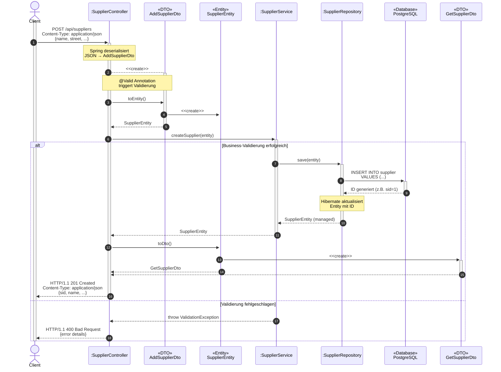

# SupplierController – Architektur & Endpunkte

## Schichtenarchitektur: Controller vs. Service

In einer gut strukturierten Spring-Boot-Anwendung trennen wir die Verantwortlichkeiten klar in verschiedene Schichten:

### Was macht ein Controller?

Der **Controller** ist Teil der **Präsentationsschicht** und hat folgende Aufgaben:

1. **HTTP-Kommunikation verwalten**
   - Endpunkte definieren (`@GetMapping`, `@PostMapping`, etc.)
   - HTTP-Requests entgegennehmen
   - HTTP-Status-Codes und Header setzen
   - HTTP-Responses zurückgeben

2. **DTO-Handling**
   - DTOs von JSON deserializieren (automatisch durch Spring)
   - Eingabe-Validierung mit `@Valid` triggern
   - DTOs zu Entities mappen (vor Service-Aufruf)
   - Entities zu DTOs mappen (nach Service-Aufruf)
   - DTOs zu JSON serialisieren (automatisch durch Spring)

3. **Orchestrierung**
   - Service-Methoden aufrufen
   - Mehrere Service-Aufrufe koordinieren (falls nötig)
   - Exceptions in HTTP-Fehler übersetzen

**Was macht ein Controller NICHT?**
- ❌ Business-Logik implementieren
- ❌ Direkt mit Repositories arbeiten
- ❌ Transaktionen verwalten
- ❌ Komplexe Validierungen durchführen

### Was macht ein Service?

Der **Service** ist Teil der **Business-Logik-Schicht** und hat folgende Aufgaben:

1. **Business-Logik implementieren**
   - Geschäftsregeln umsetzen (z.B. "Ein Supplier muss mindestens einen Artikel haben")
   - Fachliche Validierungen (z.B. "Dieser Name ist bereits vergeben")
   - Berechnungen durchführen

2. **Daten orchestrieren**
   - Mit Repositories interagieren
   - Mehrere Repository-Aufrufe koordinieren
   - Transaktionen verwalten (`@Transactional`)

3. **Domain-Objekte verarbeiten**
   - Nur mit **Entities** arbeiten (keine DTOs!)
   - Entity-Zustände verwalten
   - Beziehungen zwischen Entities pflegen

### Warum diese Trennung?

| Vorteil | Erklärung |
|---------|-----------|
| **Wiederverwendbarkeit** | Der Service kann von verschiedenen Controllern genutzt werden (REST-API, GraphQL, gRPC) |
| **Testbarkeit** | Service-Tests sind einfacher (keine HTTP-Mocks nötig) |
| **Separation of Concerns** | Jede Schicht hat eine klare Verantwortung |
| **Wartbarkeit** | Änderungen an der API betreffen nicht die Business-Logik |
| **Unabhängigkeit** | Business-Logik ist unabhängig von der Präsentationsform |

### Beispiel-Flow:




## SupplierService implementieren

Um das **Single Responsibility Principle** einzuhalten, lagern wir die **Business-Logik in einen Service** aus. Der Service arbeitet ausschließlich mit Entities, nicht mit DTOs. 

Im Package `supplier` eine Klasse `SupplierService` anlegen (`@Service`) und das `SupplierRepository` via **Konstruktor‑Injection** einbinden (statt `@Autowired` – besser testbar und moderne Best Practice).

```java
@Service
public class SupplierService {
    
    private final SupplierRepository supplierRepository;
    
    // Konstruktor-Injection (empfohlen)
    public SupplierService(SupplierRepository supplierRepository) {
      ...
    }
    
    // Service arbeitet NUR mit Entities
    public SupplierEntity createSupplier(SupplierEntity supplier) {
        // Hier könnte Business-Logik stehen, z.B.:
        // - Prüfen, ob Name bereits existiert
        // - Standard-Werte setzen
        // - Audit-Felder befüllen
        // - im Repository speichern
        ...
    }
    
    public SupplierEntity findById(Long id) {
        ...
    }
    
    public List<SupplierEntity> findAll() {
      ...
    }
    
    public SupplierEntity updateSupplier(Long id, SupplierEntity updatedData) {
        ...
    }
    
    public void deleteSupplier(Long id) {
        ....
    }
}
```

**Wichtig:** Der Service ist für Repository‑Zugriffe und Business-Logik verantwortlich. Er arbeitet ausschließlich mit **Entities**, kennt keine DTOs und ist damit unabhängig von der Präsentationsschicht. Später übernimmt er auch komplexere Validierungen und wirft passende Exceptions.

## Controller-Implementierung

### DTO‑Validierung im Controller

Neu ist die Annotation `@Valid` an Parameter‑DTOs im Controller (z. B. `AddSupplierDto`). Spring Boot validiert damit automatisch anhand der Bean‑Validation‑Annotationen im DTO (`@NotBlank`, `@Size`, etc.). Bei Validierungsfehlern wirft Spring automatisch eine `MethodArgumentNotValidException`.

### Beispiel-Controller mit klarer Aufgabentrennung

```java
@RestController
@RequestMapping("/store/suppliers")
public class SupplierController {
    
    
    @PostMapping
    // Response-Status 201 bei erfolgreichem Anlegen
    @ResponseStatus(code = org.springframework.http.HttpStatus.CREATED)
    public GetSupplierSimpleDTO create(@Valid @RequestBody final AddSupplierDTO dto) {
        // 1. DTO → Entity
        var addDtoEntity = AddSupplierDTO.toEntity(dto);
        // 2. Service aufrufen (Business-Logik)
        var savedEntity = this.supplierService.save(addDtoEntity);
        // 3. Entity → DTO
        return GetSupplierSimpleDTO.toDTO(savedEntity);
    }

    @GetMapping("{id}")
    public GetSupplierSimpleDTO get(@PathVariable Long id) {
        var entity = this.supplierService.readById(id);
        return GetSupplierSimpleDTO.toDTO(entity);
    }

    @GetMapping
    public List<GetSupplierSimpleDTO> getAll() {
        var entities =  this.supplierService.findAll();
        return entities.stream().map(GetSupplierSimpleDTO::toDTO).toList();
    }
       
    
    @PutMapping("/{id}")
    ...
    
    @DeleteMapping("/{id}")
    ...
}
```

**Beachte:** Der Controller ist "dünn" – er orchestriert nur, mappt DTOs und baut HTTP-Responses. Die gesamte Business-Logik steckt im Service.

Der Code enthält einige Änderungen bezüglich der letzten Tutorials. Neu ist die Annotation `@Valid` des Parameters `addSupplierDto` in der Post-Methode. Sie bewirkt, dass Spring Boot das übergebene Objekt hinsichtlich der Annotationen in der DTO-Klasse validiert. Da dessen Daten nicht mehr geändert werden, wurde es mit dem Schlüsselwort final gekennzeichnet. Das validierte DTO wird in ein Business-Objekt vom Typ SupplierEntity umgewandelt. Es referenziert im Attribut contact seine Kontaktdaten. Im nächsten Schritt wird der Supplier-Service damit beauftragt, das Objekt zu speichern. Beachte dabei, dass über den CascadeType `ALL` in der Modellklasse `Supplier` das Contact-Object automatisch in der Datenbank gespeichert wird, ohne ein Contact-Repository benutzen zu müssen. Der Supplier-Service gibt das gespeicherte Objekt zurück, das der Controller wieder in ein DTO-Objekt verwandelt und dem Client im JSON-Format zurückgibt. 

## Aufgabe
Implementiere die Endpunkte zum **Anlegen**, **Lesen (alle/ID)**, **Aktualisieren**, **Löschen** eines Lieferanten sowie einen Endpunkt „**alle Artikel eines Lieferanten**“.

Teste die Endpunkte mit dem HTTP-Client von IntelliJ:

```HTTP
### Lieferant anlegen
POST localhost:8080/suppliers
Content-Type: application/json

{
  "name": "Kerstin's Supplies",
  "city": "Bremen",
  "postcode": "22345",
  "street": "Bahnhofsstrasse 1",
  "phone": "01209380192"
}

### Alle Lieferanten lesen
GET localhost:8080/suppliers

### ....
```


