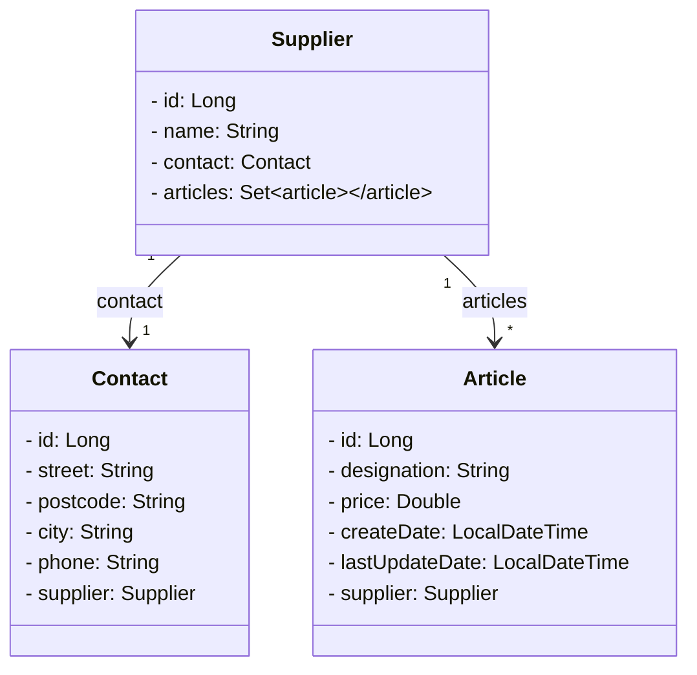

# REST-Backend für einen Webshop — Einleitung

**Lernfeld 8 – Arbeitsblatt**

**Thema:** REST-Backend für einen Webshop  
**Technologien & Inhalte:** Docker, PostgreSQL-Datenbank, Implementierung von 1:1- und 1:n‑Beziehungen zwischen Entitätsklassen, Validierung von Entity‑Objekten, DTOs, Mapping, Services

## Ziel des Tutorials
Anwendungen bestehen in der Regel aus mehreren Klassen, deren Objekte mit ihren Beziehungen untereinander persistiert werden müssen. In der folgenden Übung soll das unten abgebildete Datenmodell für einen Webshop als REST‑Backend implementiert werden.

- Ein **Lieferant (Supplier)** hat einen **Kontakt (Contact)** und ein **Kontakt** gehört immer jeweils zu einem **Lieferanten**. Es handelt sich um eine **bidirektionale Assoziation** (beide Klassen referenzieren sich).
- Zwischen **Supplier** und **Article** besteht ebenfalls eine **bidirektionale Assoziation** mit anderer Multiplizität: Ein Lieferant kann beliebig viele Artikel liefern (**1:n**), ein Artikel wird nur von **einem** Lieferanten geliefert.
- Die Klasse **Supplier** soll die zu liefernden Artikel in einem **Set** referenzieren.

Die Implementierung umfasst:
- Aufsetzen und Konfigurieren eines Spring‑Boot‑Projekts mit PostgreSQL (in Docker)
- Modellierung der Entitäten und ihrer Beziehungen (JPA/Hibernate)
- Validierung (Bean Validation)
- Entkopplung über **DTOs** und einen **Mapping‑Service**
- **Services** für Businesslogik
- **REST‑Controller** mit CRUD‑Endpunkten
- **Integrationstests** (Testcontainers)
- Zentrales **Exception‑Handling**
- Erweiterungen (z. B. HATEOAS)

